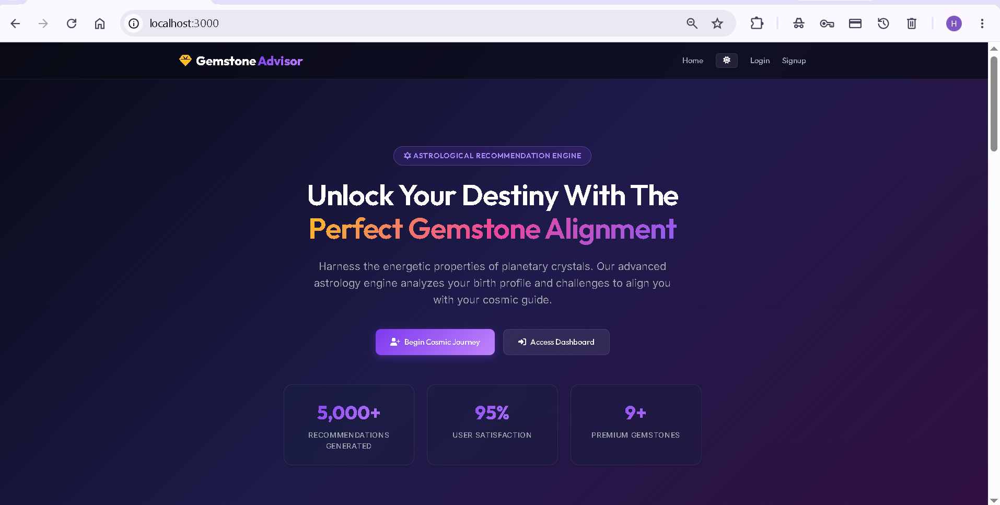
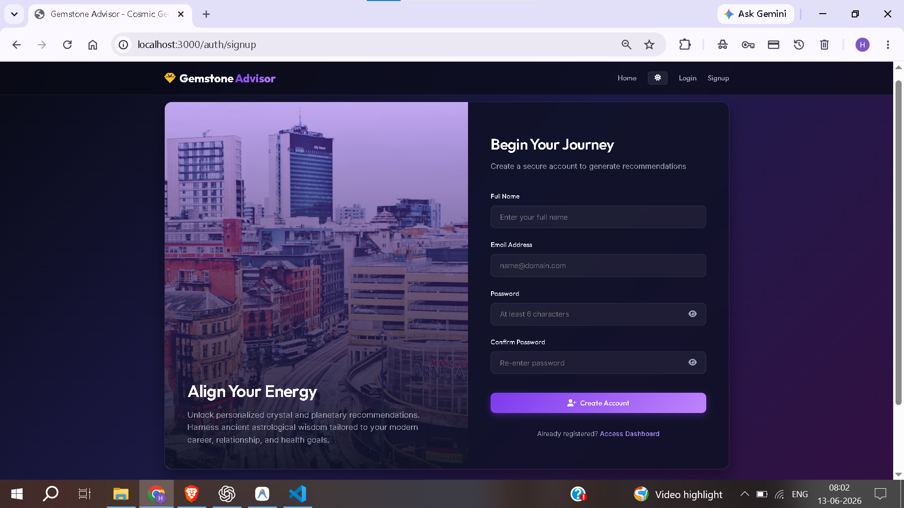
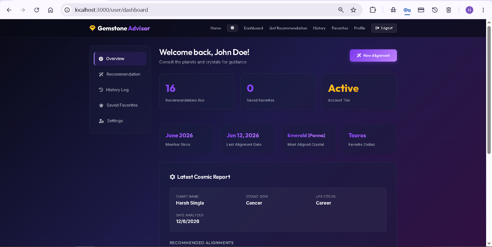
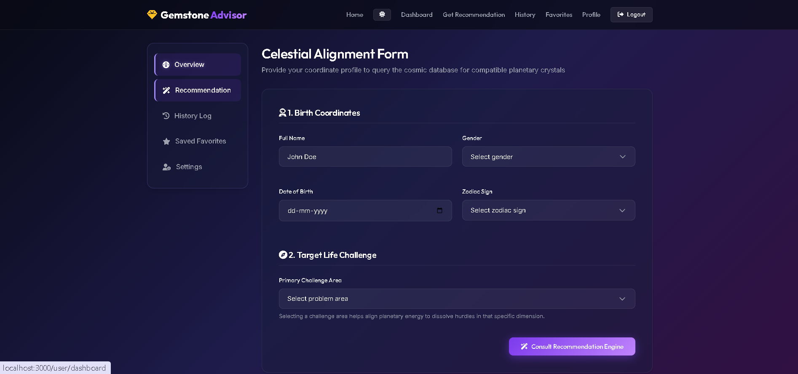
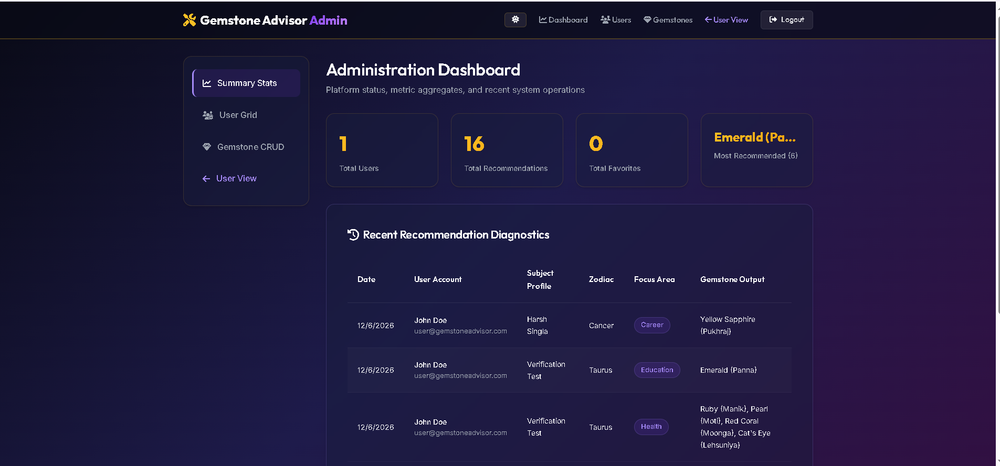

# Gemstone Advisor

A full-stack web application built using **Node.js, Express.js, MongoDB, and EJS** that recommends gemstones based on a user's zodiac sign and selected life area such as Career, Business, Money, Marriage, Health, or Education.

The goal of this project is to provide personalized gemstone recommendations while demonstrating full-stack development concepts like authentication, database management, MVC architecture, session handling, and admin dashboard development.

---

Live Demo

Application URL:
https://gemstoneadvisor.onrender.com

GitHub Repository:
https://github.com/HARSH15960/GemStoneAdvisor

---

# Features

## User Features

* User Registration and Login
* Secure Password Hashing
* Show/Hide Password
* Light and Dark Theme Toggle
* Personalized Gemstone Recommendations
* Compatibility Score Report
* Recommendation History
* Save Favorite Gemstones
* Profile Management
* Responsive User Interface

## Admin Features

* Admin Login
* Dashboard Statistics
* Manage Users
* Manage Gemstones (CRUD Operations)
* View Recommendation Records
* Search and Pagination

---

# How It Works

1. User enters:

   * Name
   * Date of Birth
   * Gender
   * Zodiac Sign
   * Focus Area

2. The system checks the gemstone database.

3. Recommendations are generated based on:

   * Zodiac Sign
   * Selected Category

4. A detailed recommendation report is displayed with:

   * Compatibility Score
   * Planet Strength
   * Benefits
   * Wearing Instructions
   * Gemstone Details

---

# Tech Stack

## Frontend

* HTML
* CSS
* JavaScript
* EJS

## Backend

* Node.js
* Express.js

## Database

* MongoDB
* Mongoose

## Authentication

* Express Session
* BcryptJS

---

# Project Structure

```text
config/
controllers/
middleware/
models/
public/
routes/
seeds/
views/
server.js
package.json
```

The project follows the MVC (Model View Controller) architecture for better code organization and maintainability.

---

# Installation

## 1. Clone Repository

```bash
git clone <repository-url>
```

## 2. Install Dependencies

```bash
npm install
```

## 3. Create Environment File

Create a `.env` file:

```env
PORT=3000
MONGODB_URI=mongodb://127.0.0.1:27017/gemstone-advisor
SESSION_SECRET=your-secret-key
```

## 4. Seed Database

```bash
npm run seed
```

## 5. Start Server

```bash
npm run dev
```

Open:

```text
http://localhost:3000
```

---

# Default Login Credentials

## Admin

Email:

```text
admin@gemstoneadvisor.com
```

Password:

```text
adminpassword123
```

## User

Email:

```text
user@gemstoneadvisor.com
```

Password:

```text
userpassword123
```

---
# Screenshots

## Home Page

The landing page of the application where users can learn about the platform and start their gemstone recommendation journey.



---

## Registration Page

New users can create an account using the signup form with password visibility toggle support.



---

## User Dashboard

The dashboard provides recommendation statistics, recent activity, and quick navigation options.



---

## Recommendation Form

Users enter their details such as zodiac sign and focus area to generate gemstone recommendations.



---

## Admin Dashboard

Admin panel for managing users, gemstones, and viewing recommendation statistics.


---

# Challenges Faced

Some challenges during development were:

* Designing recommendation logic
* Managing user sessions
* Building admin and user role management
* Creating a responsive UI
* Managing recommendation history and favorites
* Organizing the project using MVC architecture

---

# Future Improvements

* PDF Report Generation
* Email Notifications
* More Advanced Astrology Rules
* Online Consultation Booking
* AI-Based Recommendation Improvements

---

# AI Usage

AI tools were used for development assistance, UI improvements, debugging support, and documentation.

A complete disclosure is available in:

```text
AI_USAGE.md
```

---

# Conclusion

This project was built as an internship assignment and learning project to demonstrate practical full-stack development skills using Node.js, Express.js, MongoDB, and EJS.

It helped in understanding authentication, database operations, MVC architecture, session management, admin dashboards, and recommendation-based systems.
